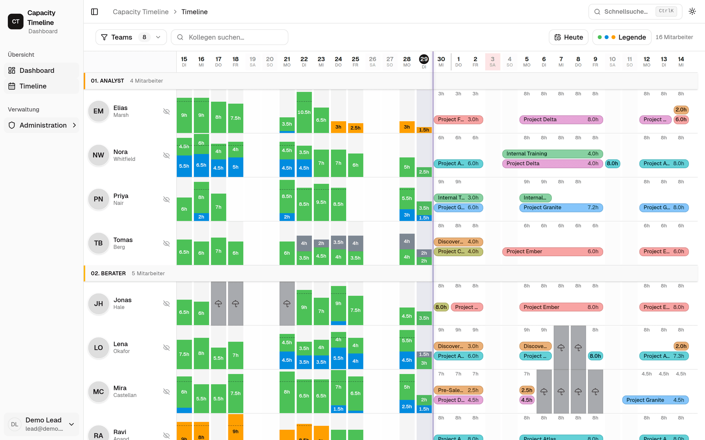
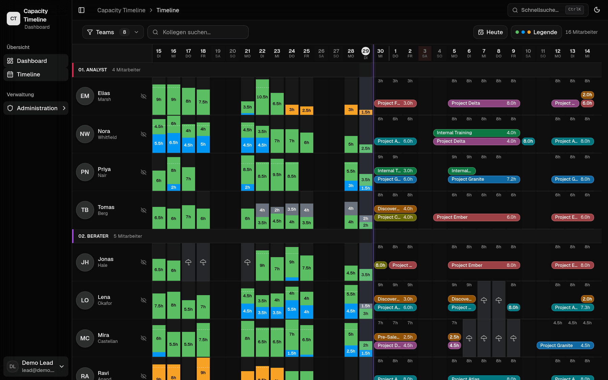
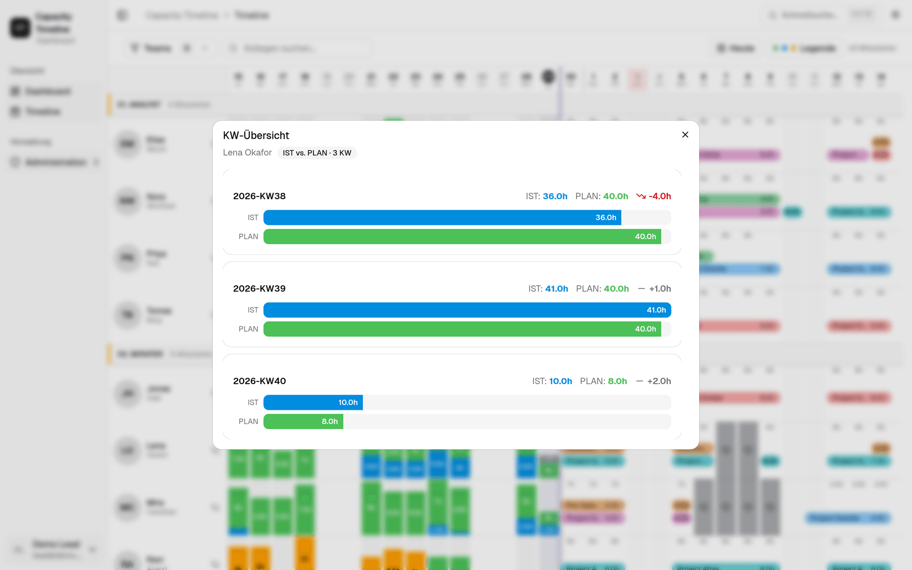
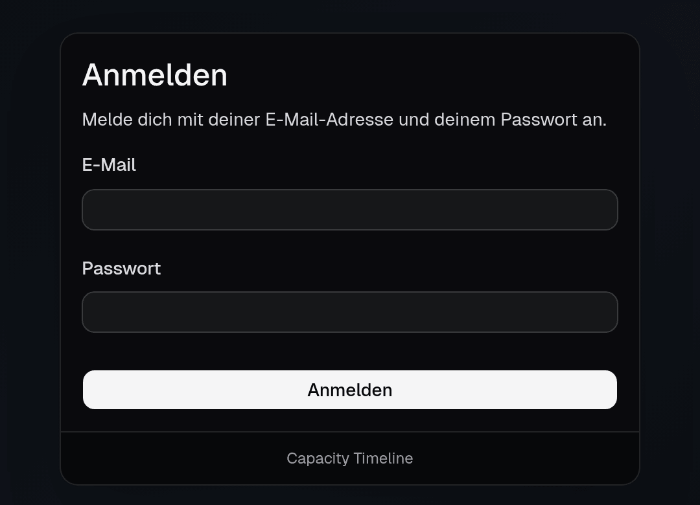
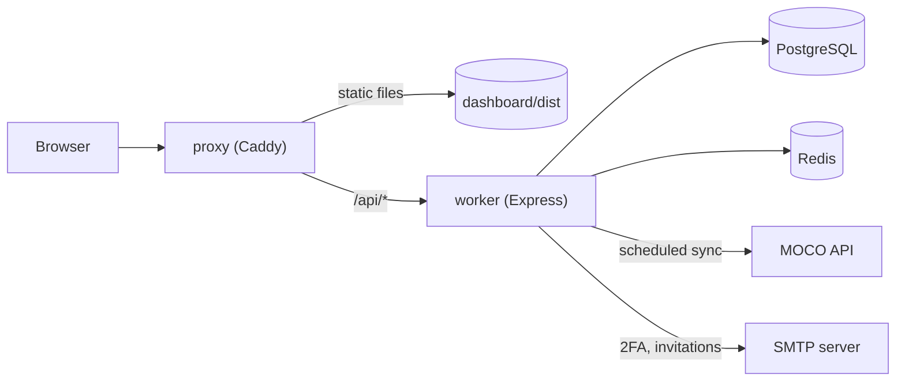

# Tideline

[](https://github.com/Hereliesviolet/tideline/actions/workflows/ci.yml)

Tideline is a web app that shows who is booked and planned on what, per person and per day, using time-tracking data from MOCO.



## Features

- Timeline with one row per person. Past days show booked hours (actual), future days show planned hours.
- Daily capacity: target hours from the person's MOCO working-time model, fill percentage, overbooking and bottleneck detection.
- Absences from MOCO schedules and a built-in public holiday list.
- Gantt-style bars for planned work, merged into runs of consecutive days per project.
- Booking classification: internal, billable, non-billable, unrated.
- Overview page with KPIs and charts (super users only).
- Login with password and a 2FA code sent by email. Invitation flow for new users.
- Visibility by team level, derived from the MOCO unit of each person. Super user role for the admin area.
- Admin area: dashboard users, invitations, password reset, session statistics.
- Background sync from the MOCO API every 15 minutes, plus a full sync once a day.
- Light and dark theme.

The UI text and the emails are in German.

MOCO is a third-party SaaS (mocoapp.com). You need your own account and API token. This project is not affiliated with MOCO.

## Screenshots

All screenshots show generated demo data (a fictional company with invented people, customers and projects). The UI is in German.

| Screenshot | Description |
|------------|-------------|
|  | Timeline in the dark theme. |
|  | Weekly dialog for one person: booked versus planned hours for the last three calendar weeks. |
|  | Login page. |

## Tech stack

| Part | Technology |
|------|------------|
| Frontend | React 18, TypeScript, Vite 5, Tailwind CSS 4, shadcn/ui (Radix), TanStack Query, jotai, Recharts |
| Backend | Node.js, Express 4, Prisma 6, node-schedule, Nodemailer, zod |
| Data | PostgreSQL 16, Redis 7 (cache) |
| Proxy | Caddy 2.10 with the `caddy-ratelimit` plugin |
| Tooling | Docker Compose, ESLint 9, Prettier, Vitest, GitHub Actions |

## Architecture



The frontend only talks to the worker. The worker copies MOCO data into PostgreSQL on a schedule and answers all queries from there. Details are in [docs/ARCHITECTURE.md](docs/ARCHITECTURE.md), access rules in [docs/PERMISSIONS.md](docs/PERMISSIONS.md).

## Quick Start

Requirements: Docker with Compose, Node.js 20 or 22, a MOCO account with an API token, an SMTP account for the login mails.

```bash
git clone https://github.com/Hereliesviolet/tideline
cd tideline

# 1. Configuration
cp .env.example .env
cp worker/.env.example worker/.env
# Fill in both files. The passwords in DATABASE_URL and REDIS_URL must match .env.

# 2. Runtime directories (the worker runs as uid 1000 and writes avatars)
mkdir -p db/data redis/data avatars caddy/logs
chown 1000:1000 avatars

# 3. Build the frontend (Caddy serves dashboard/dist)
(cd dashboard && npm ci && npm run build)

# 4. Start the stack and create the schema
docker compose up -d --build
docker compose exec worker npx prisma db push
docker compose restart worker   # the startup sync then loads the MOCO data
```

The app is now at <http://localhost:8080>. Errors from the startup sync before `db push` are expected, because the tables do not exist yet.

Create the first user. The email must belong to a MOCO user that has been synced:

```bash
docker compose exec worker node dist/scripts/create-admin-invite.js you@example.com
```

The script mails an invitation link, and prints it if sending fails. After you have accepted the invitation, make the account a super user, since the invitation flow does not set that flag:

```bash
docker compose exec db psql -U capacity capacity \
  -c "UPDATE \"DashboardUser\" SET \"superUser\" = true WHERE email = 'you@example.com';"
```

The proxy serves plain HTTP on localhost only. For any other use, put a TLS-terminating reverse proxy in front of it.

Other scripts in `worker/src/scripts/`: `reset-password.js <email> <new-password>` and `reset-moco-data.js` (deletes all synced MOCO data, keeps dashboard users).

### Development

Both packages have the same scripts:

```bash
cd dashboard   # or: cd worker
npm ci
npm run lint
npm run typecheck
npm test
npm run build
```

`npm run format` runs Prettier. CI runs lint, typecheck, test and build for both packages on Node 20 and 22, and validates `docker-compose.yml`.

## Configuration

Compose reads `.env`. The worker reads `worker/.env`. The frontend reads `dashboard/.env` at build time.

| Variable | File | Default | Description |
|----------|------|---------|-------------|
| `POSTGRES_PASSWORD` | `.env` | none | Database password. Must match `DATABASE_URL`. |
| `REDIS_PASSWORD` | `.env` | none | Redis password. Must match `REDIS_URL`. |
| `DATABASE_URL` | `worker/.env` | none | PostgreSQL connection string. Database and user are both `capacity` in `docker-compose.yml`. |
| `REDIS_URL` | `worker/.env` | `redis://redis:6379` | Redis connection string. Caching is skipped if Redis is unavailable. |
| `MOCO_BASE_URL` | `worker/.env` | none | `https://<subdomain>.mocoapp.com/api/v1` |
| `MOCO_API_TOKEN` | `worker/.env` | none | MOCO API token. Sync stays off while MOCO settings are missing. |
| `SMTP_HOST`, `SMTP_PORT`, `SMTP_USER`, `SMTP_PASS` | `worker/.env` | port `587` | SMTP server for 2FA codes, invitations and password resets. |
| `SMTP_FROM` | `worker/.env` | `noreply@example.com` | Sender address. |
| `FRONTEND_URL` | `worker/.env` | `http://localhost:8080` | Public URL. Used for links in mails and as an allowed CORS origin. |
| `JWT_SECRET` | `worker/.env` | none | Required, at least 32 random characters. The worker does not start without it. |
| `JWT_EXPIRES_IN` | `worker/.env` | `24h` | Token lifetime. |
| `SYNC_ENABLED` | `worker/.env` | `true` | `false` disables all MOCO sync jobs. |
| `MOCO_PER_PAGE` | `worker/.env` | `100` | Page size for MOCO API requests. |
| `PORT` | `worker/.env` | `9100` | Worker port inside the Compose network. |
| `TZ` | `worker/.env` | none | Time zone of the worker container. |
| `VITE_INTERNAL_CUSTOMER_NAME` | `dashboard/.env` | `Internal` | Name of the MOCO customer that represents your own organisation. Its bookings count as internal. |

Team levels are derived from MOCO unit names such as `04. Manager`. The mapping is in `worker/src/lib/mocoMapping.ts` (and a copy in `dashboard/src/lib/`). Adapt it to your own units, see [docs/PERMISSIONS.md](docs/PERMISSIONS.md).

## Roadmap

- Make the team-level mapping configurable instead of hardcoded.
- Replace the hardcoded holiday list (Hamburg, 2025 to 2027) with a configurable calendar.
- Move UI and mail text to a translation layer. Both are German only.
- Use Prisma migrations instead of `db push`.
- Merge the duplicated capacity logic in `dashboard/src/lib` and `worker/src/lib`.
- Add integration tests for the routes and the sync job, and clear the ESLint warnings (mostly `any`).

## License

MIT, see [LICENSE](LICENSE). Author: Jan Beinert.
