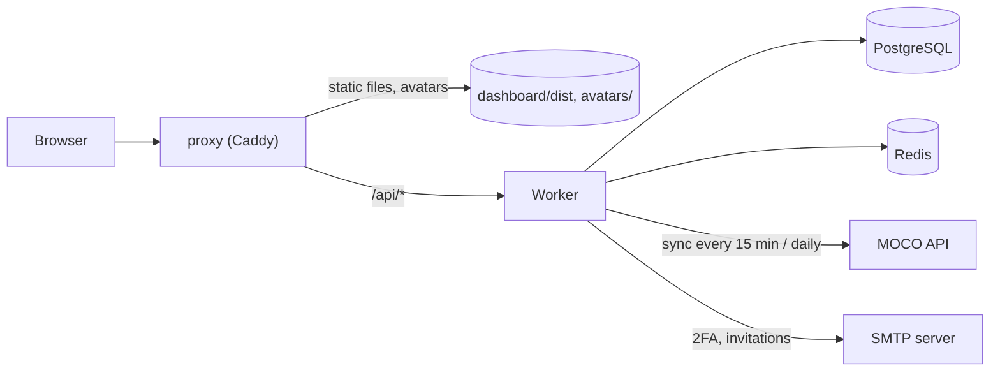

# Architecture

Capacity Timeline reads people, bookings, planning and absences from MOCO, stores them in PostgreSQL and serves them to a React single-page app.

## Components

| Component | Technology | Role |
|-----------|------------|------|
| `proxy` | Caddy 2.10 with `caddy-ratelimit` | Serves the built frontend and cached avatars, forwards `/api/*` to the worker, sets security headers, rate-limits per client IP. Listens on HTTP `:8080`, published on `127.0.0.1` only. |
| `worker` | Node.js 20, Express 4, Prisma 6 | REST API, authentication, MOCO sync jobs (node-schedule), mail sending. Port 9100, not published. |
| `db` | PostgreSQL 16 | Synced MOCO data and dashboard accounts. |
| `redis` | Redis 7 | Optional response cache (short TTLs). Losing it only costs speed. |
| `dashboard` | React 18, Vite 5, TypeScript, Tailwind CSS 4, shadcn/ui, TanStack Query | Single-page app, built to `dashboard/dist` and served by the proxy. |



Start order is enforced by health checks: `db` and `redis`, then `worker`, then `proxy`. Memory limits in `docker-compose.yml`: db 512M, redis 128M, worker 1G, proxy 128M.

## Request path

1. The browser loads the SPA from the proxy. Hashed files under `/assets/` are cached for a year.
2. The SPA calls relative `/api/...` URLs with `Authorization: Bearer <jwt>`. The token is kept in `localStorage`.
3. The proxy rate-limits (5 requests/min on `/api/auth/login`, 600/min on other `/api/*` paths, per client IP) and forwards to the worker.
4. The worker validates the JWT, loads the dashboard user, applies the visibility rules (see [PERMISSIONS.md](PERMISSIONS.md)) and answers from PostgreSQL or Redis.
5. Avatars (`/api/avatars/<id>`) are served by the proxy directly from `avatars/` without authentication.

The frontend never talks to MOCO. Only the worker holds the MOCO token.

## Worker layout

```text
worker/src/
  index.ts             Express app, CORS, health and metrics endpoints, sync scheduling
  routes/              auth, admin, users, activities, timeline, schedules, avatars, sessions
  jobs/syncCore.ts     MOCO sync (full and frequent) and upserts
  lib/                 mocoClient, mocoMapping, capacity, ganttDataTransform, email, cache, auth
  middleware/auth.ts   JWT check, requireSuperUser, requireAdminLevel
  scripts/             one-off CLI tools (invite, password reset, data reset)
```

## API overview

All paths are below `/api`. "JWT" means a valid bearer token; "SU" means additionally super user.

| Method | Path | Access | Purpose |
|--------|------|--------|---------|
| POST | `/auth/login` | public | Check email and password, send a 2FA code |
| POST | `/auth/verify-2fa` | public | Exchange the code for a JWT |
| POST | `/auth/resend-2fa` | public | Send the code again (max. 3 times) |
| POST | `/auth/accept-invite` | public | Set a password from an invitation link |
| GET | `/auth/me` | JWT | Current user |
| POST | `/auth/heartbeat` | JWT | Session activity ping |
| POST | `/auth/logout` | JWT | End the session |
| GET | `/timeline` | JWT | Bookings, planning, capacities, bottlenecks and gantt features for a range |
| GET | `/users`, `/users/:userId/employments`, `/users/:userId/schedules`, `/users/:userId/week-overview`, `/users/offices` | JWT | People and their working models, absences and weekly view |
| GET | `/activities` | JWT | Time bookings |
| GET | `/schedules` | JWT | Absences |
| GET | `/avatars/:userId` | JWT | Cached avatar (the proxy serves these without a token) |
| GET | `/users/:userId/sessions` | SU | Session statistics of a dashboard user |
| GET, PUT, DELETE, POST | `/admin/...` | SU | Dashboard users, invitations, password reset, timeline users, sessions |

Outside `/api`: `GET /healthz` (public) and `GET /metrics` (Prometheus format, answers only for requests from localhost). The proxy forwards neither.

## Data model

Defined in `worker/prisma/schema.prisma` (22 models). There is no `migrations/` directory; the schema is applied with `prisma db push`.

**MOCO data** (read-only mirror): `User`, `Project`, `Activity` (booked time), `PlanningEntry`, `Schedule` (absences), `Company`, `Task`, `Employment` (working time model), `UserHoliday`, `UserPresence`, `WorkTimeAdjustment`, `Contact`, `Tag`, `Unit`, `ProjectExpense`, `ProjectPaymentSchedule`, `ProjectGroup`, `ProjectContract`.

**Dashboard data** (not derivable from MOCO):

| Model | Purpose |
|-------|---------|
| `DashboardUser` | Login account linked to a MOCO user: password hash, team level, super user flag, activity and session counters |
| `PendingLogin` | Hashed 2FA code and attempt counters for a login in progress |
| `Invitation` | Single-use invitation token |
| `SyncState` | Cursor per synced resource, used for incremental sync |

## MOCO sync

| Job | When | What |
|-----|------|------|
| Startup | worker start | Frequent sync, then a full sync if the last one is older than one hour |
| Frequent | every 15 minutes | Activities, schedules and planning entries changed since the last run (`updated_after`) |
| Full | daily 02:07 Europe/Berlin | Users, projects, tasks, companies and other master data; activities, schedules and planning for the whole window, including removal of entries deleted in MOCO |

A lock prevents overlapping runs. `SYNC_ENABLED=false` turns all sync jobs off. The MOCO client retries rate-limited requests with backoff.

## Authentication

1. `POST /auth/login` checks email and password (bcrypt) and stores a hashed six-digit code (`crypto.randomInt`) with a 10 minute lifetime. The code is mailed to the user.
2. `POST /auth/verify-2fa` accepts the code (max. 5 attempts) and returns an HS256 JWT. The secret comes from `JWT_SECRET`; the worker refuses to start without it. Lifetime is `JWT_EXPIRES_IN` (default 24h).
3. While the app is open, the SPA sends a heartbeat every 60 seconds. The worker adds the time since the previous heartbeat to the session counters if the gap is at most 5 minutes. A user counts as online if the last activity is younger than 5 minutes.
4. New users are invited from the admin area (or with `create-admin-invite`). The mail contains a link to `/accept-invite?token=...` (valid 7 days).

## Security measures

| Measure | Detail |
|---------|--------|
| Rate limits | Proxy: per client IP as above. Worker: `express-rate-limit`, 10 requests per 15 minutes on login and 2FA verification. |
| Client IP | The proxy trusts private ranges for `X-Forwarded-For`, so `{client_ip}` is the real client when a TLS proxy sits in front. The worker sets `trust proxy` to `loopback, uniquelocal`. |
| Headers | CSP, HSTS, `X-Frame-Options`, `nosniff`, referrer and permissions policy set by the proxy; `Server` and `X-Powered-By` removed. |
| CORS | Allows `http://localhost:8080`, `http://127.0.0.1:8080` and the origin from `FRONTEND_URL`. |
| Passwords | bcrypt, 8 to 128 characters (zod schema). |
| Input | Auth and admin request bodies validated with zod; queries use Prisma or parameterised raw SQL. |
| Ports | No service except the proxy is published, and the proxy binds to localhost. |
| Container | Worker image is multi-stage and runs as the unprivileged `node` user. |

Known gaps are listed in the README roadmap.

## Repository layout

```text
.
├── caddy/               Proxy config (Caddyfile, Dockerfile with rate-limit plugin)
├── dashboard/           React SPA (src/app, components, features, lib, hooks)
├── worker/              API and sync worker (Dockerfile, prisma/, src/)
├── docs/                This document and PERMISSIONS.md
├── docker-compose.yml   db, redis, worker, proxy
└── .github/workflows/   CI
```
